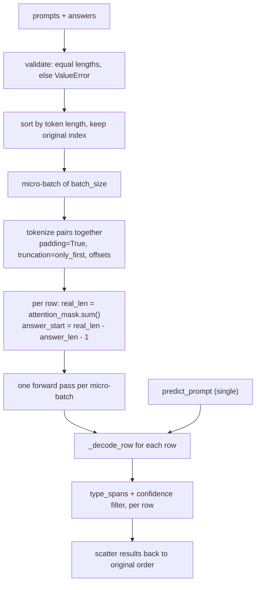

# Proposal: real batched inference for TransformerDetector

Issue: [#23](https://github.com/KRLabsOrg/LettuceDetect/issues/23)
Status: proposal, no code yet

## Summary

`TransformerDetector.predict_prompt_batch` runs one tokenization and one forward pass per pair
(`transformer.py:435-453`). This proposes padded-batch tokenization, one forward pass per
micro-batch, and one shared row decoder used by both the single and the batch path. Only the
expensive step changes; token-to-span decoding, taxonomy typing and confidence filtering stay
per row and unchanged.

## What is wrong today

- `predict_prompt_batch` is a list comprehension over `predict_prompt`, N forwards for N pairs.
- `zip(prompts, answers)` at `transformer.py:452` and `llm.py:612,614` silently drops trailing
  items when the lists differ in length.
- `_predict_single` indexes batch position 0 in four places (`transformer.py:168,180,181,187`),
  so it cannot take a padded batch as is.
- `HallucinationDataset.prepare_tokenized_input` computes
  `answer_start_token = total_seq_len - answer_token_count - 1`
  (`hallucination_dataset.py:178`). With right padding `total_seq_len` is the padded width, so
  the formula is wrong for every row except the longest.

## Design



### 1. Validate

`BaseDetector._validate_batch_inputs(prompts, answers)` raises `ValueError` on a length
mismatch. All three detectors call it; the LLM detector keeps its thread pool otherwise.

### 2. Micro-batches

`predict_prompt_batch(..., batch_size: int = 16)`. The base class gains the same optional
argument so other detectors can ignore it. Pairs are sorted by token length before batching so
a 30-token answer is not padded to an 800-token neighbour; the original index travels with each
pair and results are written back in input order.

### 3. Batch tokenization

`HallucinationDataset.prepare_tokenized_batch(tokenizer, prompts, answers, max_length)` next to
the existing single-pair helper. It calls the tokenizer once with lists, `padding=True`,
`truncation="only_first"` and `return_offsets_mapping=True`, and sets `padding_side="right"`
explicitly. It returns `encoding`, `offsets` of shape `[B, L, 2]`, and one `answer_start` per
row computed from that row's `attention_mask.sum()`, not from the padded width.

### 4. One forward, then per-row decoding

The token-to-span loop moves out of `_predict_single` into
`_decode_row(input_ids, preds, probs, offsets, answer_start, answer, output_format)`.
`_predict_single` becomes a batch of one that calls the same function, so single and batch
output are identical by construction rather than by tolerance. Existing post-processing runs
per row exactly as `predict_prompt` does now: `typer.type_spans(answer, prompt, spans)` only
for `"spans"`, then `_filter_spans_by_confidence(spans, output_format, min_confidence)`.

### 5. Numerics

On ModernBERT a padded batch is not bit-identical to single-sequence inference (attention
path differs; some `transformers` releases had padded-batch bugs). The contract is therefore:
identical spans on the offline stub model, and a documented tolerance on real models.
`attn_implementation="eager"` already reaches the model through `**tok_kwargs`
(`transformer.py:57`) for anyone who needs the stricter path.

## Worked example

Three pairs padded together with the test-suite tokenizer (`tests/conftest.py`), one
tokenizer call, `[B, L] = [3, 13]`:

```text
row 0: [CLS] the capital of france is [SEP] paris [SEP] [PAD] [PAD] [PAD] [PAD]
       real_len=9   answer_len=1   old answer_start=11 -> '[PAD]'   new=7 -> 'paris'
row 1: [CLS] the capital [SEP] paris . [SEP] [PAD] [PAD] [PAD] [PAD] [PAD] [PAD]
       real_len=7   answer_len=2   old answer_start=10 -> '[PAD]'   new=4 -> 'paris'
row 2: [CLS] the capital of france is paris . [SEP] short answer word [SEP]
       real_len=13  answer_len=3   old answer_start=9  -> 'short'   new=9 -> 'short'
```

With the current formula only the longest row is right; the other two start decoding inside
the padding. One forward pass returns logits `[3, 13, 2]`, and each row is then decoded over
its own answer region: `[7:8]`, `[4:6]`, `[9:12]`.
